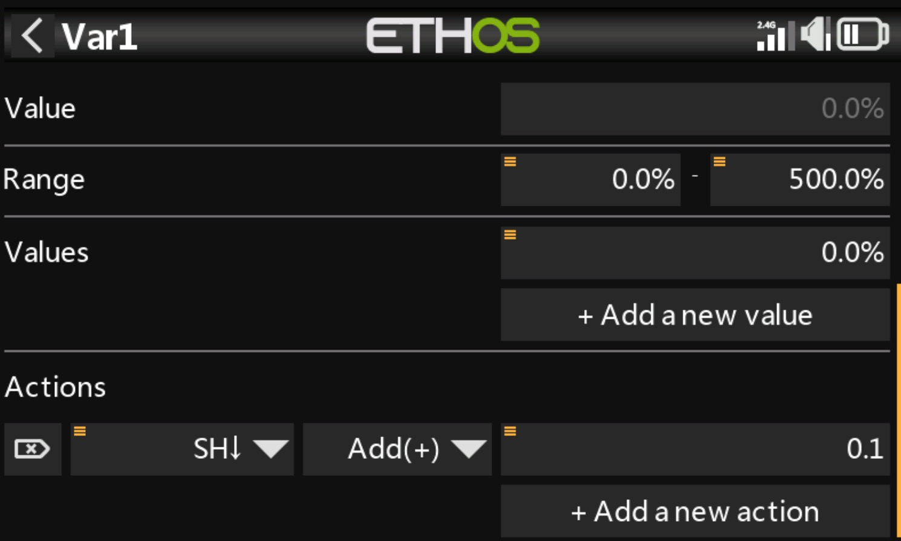

import ValueDisplay from "../../../components/ValueDisplay.svelte";
import Simulator from "../../../components/Simulator.svelte";
import { CATEGORY_TELEMETRY_SENSOR, COLOR_RED, COLOR_ORANGE, COLOR_YELLOW, COLOR_CYAN, COLOR_BLUE, COLOR_WHITE, THEME_DEFAULT_BGCOLOR, THEME_DEFAULT_COLOR } from "../../../components/ethos_constants.js";

As a first step we create a var, each time we pull SH, a flight is added (of course in practice you would use a Logic Switch to increase Var1 with a more complex logic).

 
Then, we can use the `_10v` tag to make a very simple flight counter without having to create a calculated telemetry sensor. So we create a catch-all conditions
and simply use this tag. We also change the name displayed in the title.

 
<Simulator
  client:load
  initialSource="Var1"
  options={{ showTitle: true, showMinMax: false, useState: true }}
  logics={[
    { op: " > ", threshold: 0, color: THEME_DEFAULT_COLOR,    bgcolor: THEME_DEFAULT_BGCOLOR,    title: "Flights", text: "_10v" },
  ]}
/>
