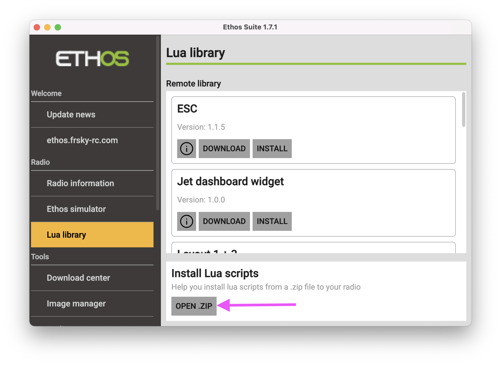

The Ethos version on the radio must be ≥ 1.6.3

## Download From GitHub

Goto [the latest stable release page](https://github.com/flyingeek/ethos-color-value/releases/latest)

## Ethos Suite install

## Manual install step
If you prefer the manual method, unzip the download, then open your radio’s script folder and drag the folder named **exactly** `color-value` into it.

## Widget explanation
After installation, two new widgets become available: **Color Value** and **Color Telemetry**. They use the same underlying code, but **Color Telemetry** limits the source to a telemetry sensor—so if you’re using telemetry, it’s faster to set up with Color Telemetry.
