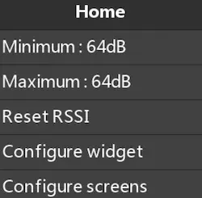

import ValueDisplay from "../../../components/ValueDisplay.svelte";
import Simulator from "../../../components/Simulator.svelte";
import { CATEGORY_TELEMETRY_SENSOR, COLOR_RED, COLOR_ORANGE, THEME_DEFAULT_BGCOLOR } from "../../../components/ethos_constants.js";

**Color Value** is a widget designed to match the Ethos's Value widget. In its most basic form, it is almost indistinguishable. from the original.

## Minimum and Maximum

Set the source to be a telemetry sensor, then it can output the minimum and the maximum inside widget's output:

<ValueDisplay
  source={{ name: "RSSI", value: 64, unit: "dB", category: CATEGORY_TELEMETRY_SENSOR, minValue: 42, maxValue: 78 }}
/>

But if you prefer classic output, turns Minimum and Maximum to OFF

<ValueDisplay
  source={{ name: "RSSI", value: 64, unit: "dB", category: CATEGORY_TELEMETRY_SENSOR, minValue: 42, maxValue: 78 }}
  options={{showMinMax: false}}
/>

Then you can access those values from the contextual menu of the widget.

## Add some colors

The UI of the widget is very simple to understand, here we are using a RxBatt Source, and we add color when below certain thresholds. You can play with the simulator by changing the source value (top right) or by changing the thresholds in the configure panel.
 
<Simulator
  client:load
  initialSource="RxBatt"
  options={{ showTitle: true, showMinMax: true }}
  logics={[
    { op: " ≤ ", threshold: 3.5, color: COLOR_RED,    bgcolor: THEME_DEFAULT_BGCOLOR,    title: "", text: "" },
    { op: " < ", threshold: 3.7, color: COLOR_ORANGE, bgcolor: THEME_DEFAULT_BGCOLOR, title: "", text: "" },
  ]}
/>

:::note
The order of the conditions is important, it is quite easy to always be right:
- starts by testing for equality if needed then
- if using `<` always begins with the lowest threshold value
- if using `>` always begins with the highest threshold value
:::

## Add some background colors

If you need a vibrant alert, why not add a red background: Try to reduce the value of the source below 3.5V.

 
<Simulator
  client:load
  initialSource="RxBatt"
  options={{ showTitle: true, showMinMax: true, useBackground: true }}
  logics={[
    { op: " ≤ ", threshold: 3.5, color: THEME_DEFAULT_BGCOLOR,    bgcolor: COLOR_RED,    title: "", text: "" },
    { op: " < ", threshold: 3.7, color: COLOR_ORANGE, bgcolor: THEME_DEFAULT_BGCOLOR, title: "", text: "" },
  ]}
/>
